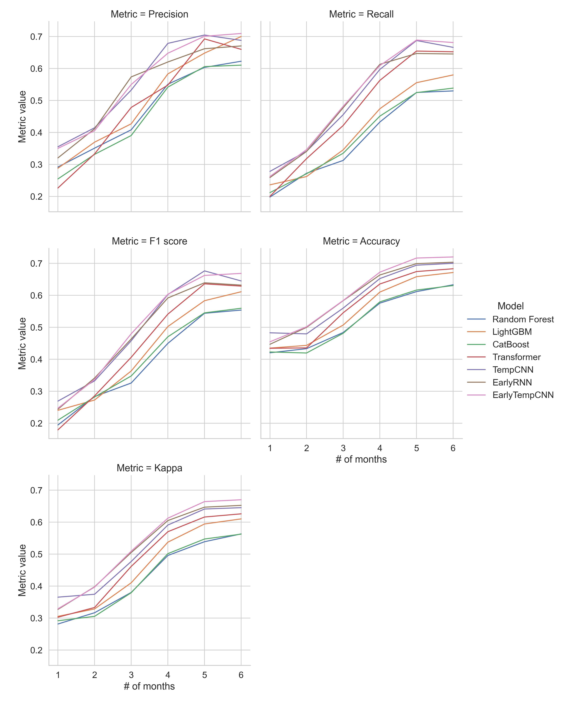
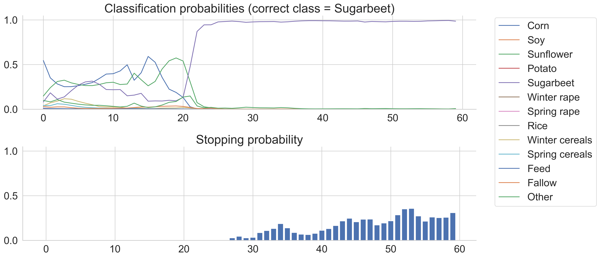

# Application of Machine Learning for Early Crop Classification Using Satellite Imagery



My Master's thesis on [HSE MDS program](https://www.hse.ru/en/ma/mds/).

Based on this paper:
> Marc Rußwurm, Nicolas Courty, Remi Emonet, Sebastien Lefévre, Devis Tuia, and Romain Tavenard (2023). End-to-End Learned Early Classification of Time Series for In-Season Crop Type Mapping. ISPRS Journal of Photogrammetry and Remote Sensing. 196. 445-456. https://doi.org/10.1016/j.isprsjprs.2022.12.016

## Dependencies

```
python -m venv venv
source venv/bin/activate
pip install -r requirements.txt
```

## Getting Started

Training, models comparison, inference, robustness check are in `Crop Clasification.ipynb`



Slides are in `Presentation.odp`.

## CLI (may not work for some datasets)

Look at the code of `train.py` to see all the options. Russian dataset is private.

### Monitor training visally (optional)

Start [visdom](https://github.com/fossasia/visdom) server for visual training progress.

```bash
❯ visdom
Checking for scripts.
It's Alive!
INFO:root:Application Started
You can navigate to http://localhost:8097
```

Navigate to [http://localhost:8097/](http://localhost:8097/) in the browser of your choice.


### Start training loop

To start the training loop, run the following command.

```
❯ python train.py
Setting up a new session...
epoch 100: trainloss 1.70, testloss 1.97, accuracy 0.87, earliness 0.48. classification loss 7.43, earliness reward 3.48: 100%|███| 100/100 [06:34<00:00,  3.95s/it]
```

The BavarianCrops dataset is automatically downloaded.
Additional options (e.g., `--alpha`, `--epsilon`, `--batchsize`) are available with `python train.py --help`.

### Other examples

```
python train.py --dataroot /data/sustainbench --dataset ghana
python train.py --dataroot /data/sustainbench --dataset southsudan --epochs 500
```

### Docker

It is also possible to install dependencies in a docker environment

```
docker build -t elects .
```

and run the training script

```
docker run elects python train.py
```
